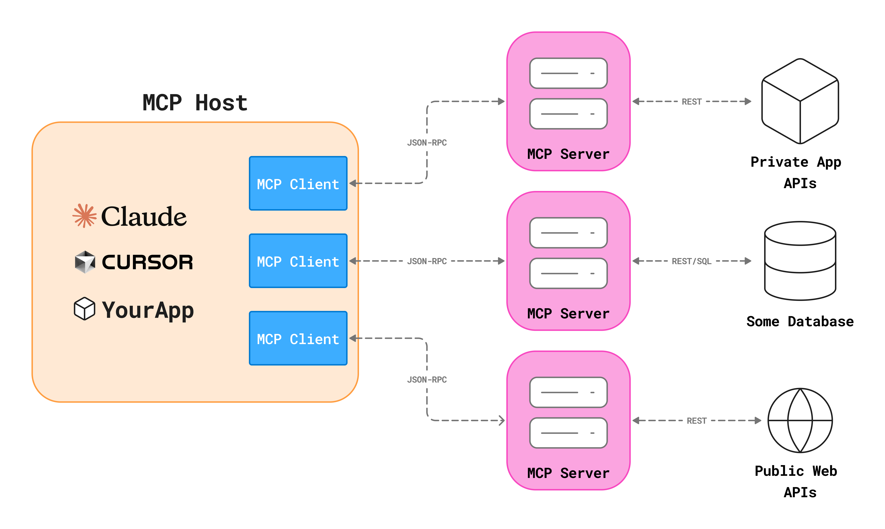
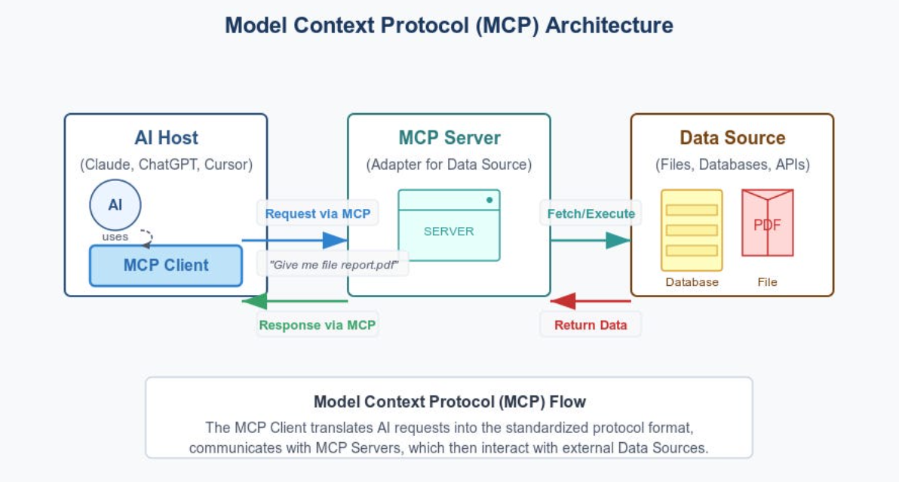

# 🧩 MCP Demo with LangChain, LangGraph & UV

This project demonstrates how to **build custom MCP (Model Context Protocol) servers**
and integrate them with a **LangGraph ReAct agent** using **LangChain MCP adapters**.
All dependencies are managed using the **UV package manager**.

---

## 🖼️ MCP Host–Server Architecture



**What this shows:**
- An **MCP Host** (Claude, Cursor, or your own app) runs MCP clients.
- Each MCP client maintains a **1:1 JSON-RPC connection** with an MCP server.
- MCP servers act as adapters to:
  - Private APIs
  - Databases
  - Public web APIs

In this project, the **LangGraph agent acts as the MCP host**.

---

## 🖼️ MCP Servers, Clients & Agent Interaction


**Explanation:**
- Each MCP server can expose **multiple tools**.
- MCP clients live inside the host application.
- The **LangGraph ReAct agent dynamically loads MCP tools**
  and decides when to invoke them.
- Your Python MCP client uses `load_mcp_tools` internally via adapters.

This maps directly to:
- `mathserver.py` → Math tools
- `weather.py` → Weather tool

---

## 🖼️ Model Context Protocol (MCP) Flow



**Flow explained step-by-step:**
1. User asks a question
2. LLM reasons inside the agent
3. MCP Client sends a standardized request
4. MCP Server fetches or executes logic
5. Data is returned back through MCP
6. Agent responds with final output

---

## 📁 Project Structure

```
mcp-demo-langchain/
│
├── client.py            # MCP client + LangGraph ReAct agent
├── mathserver.py        # Math MCP server (stdio)
├── weather.py           # Weather MCP server (streamable-http)
│
├── requirements.txt
├── pyproject.toml
├── uv.lock
├── README.md
├── .gitignore
├── .env
└── .venv/
```

---

## ⚙️ Setup Using UV

```bash
pip install uv
uv venv
source .venv/bin/activate
uv pip install -r requirements.txt
```

---

## 🚀 Running the Project

### Start Weather MCP Server
```bash
python weather.py
```

### Run MCP Client & Agent
```bash
python client.py
```

---

## 🧪 Example Outputs

**Math**
```
User: what's (3 + 5) x 12?
Output: 96
```

**Weather**
```
User: what is the weather in California?
Output: It's always raining in California
```

---

## ✨ Key Takeaways

- MCP standardizes tool communication for LLMs
- MCP servers are reusable, language-agnostic adapters
- LangGraph enables structured agent reasoning
- UV provides fast, reproducible dependency management

---

## 📄 License

For educational and demonstration purposes.
